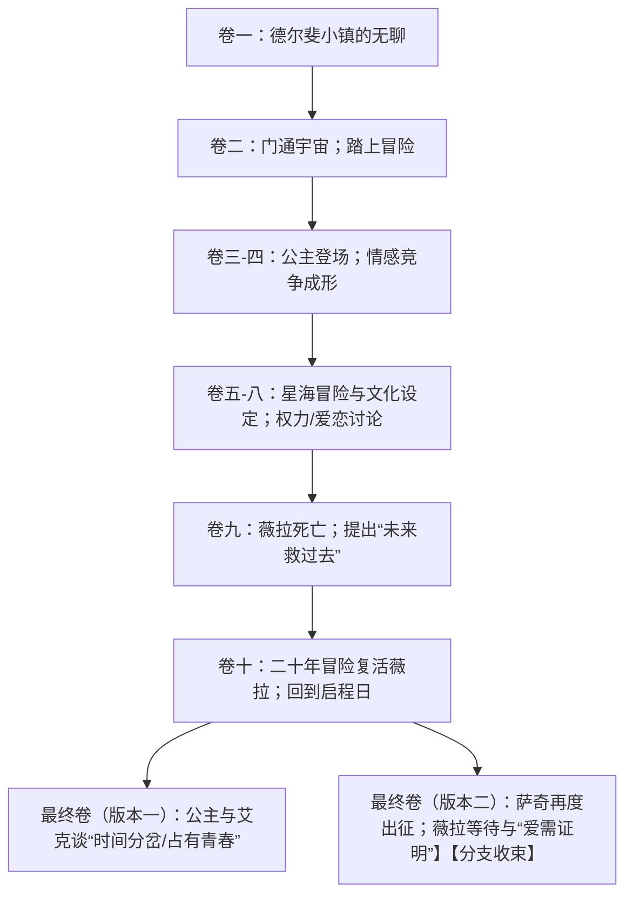
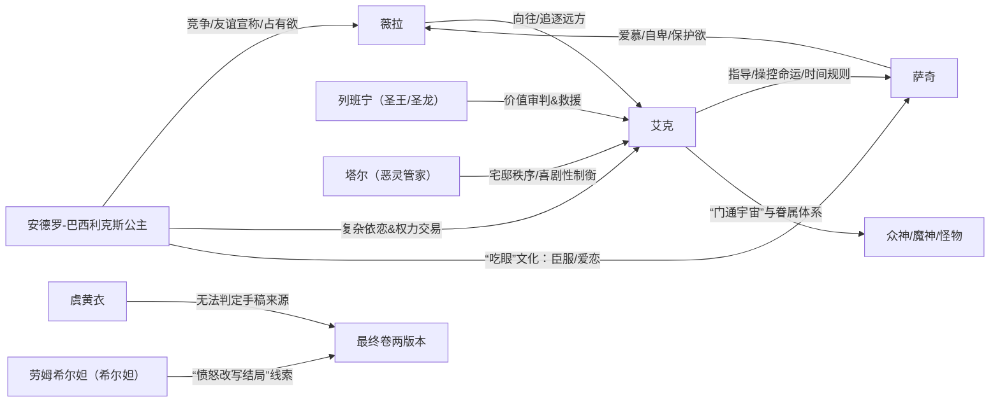

# 《少女薇拉的忧郁》故事内容深度研究报告

## 执行摘要
《少女薇拉的忧郁》是一套以“少女的无聊感”为起点、迅速滑向太空歌剧与时间命运议题的小说体“书中书”。其叙事核心是：小镇德尔斐的少女薇拉与青梅竹马萨奇，在邂逅自称千岁“贤者/魔法师”的艾克后，卷入跨星系冒险、情感错位与“未来拯救过去”的悖论。文本在前十卷以戏谑与壮阔并行的方式完成一次“告别童年、抵达青春”的成长叙事，而最新补完的两个“最终卷”（版本一/版本二）并非简单续写，而是以“同一结局的两份手稿”形式同时给出两种收束：一种偏向“公主—艾克”的余波与时间分岔；另一种偏向“萨奇离去—薇拉等待”的爱情证明与世界中心隐喻。两份最终卷的出现，进一步把作品从“浪漫太空冒险”推向“文本本身为何会有多版本”的元叙事问题，并与新区域“空之神殿/Temple of Space”及相关NPC线索产生直接勾连。citeturn35view0turn23view0turn23view1turn44view0

## 版本范围与资料来源
本报告以“截至当前最新版本”为检索边界撰写（当前日期：2026-04-14；用户未指定具体版本号）。在较早的攻略语境中，《少女薇拉的忧郁》被普遍视为“共10卷”的可收集书籍套装。citeturn34view0 而截至近期更新，至少两条独立线索共同指向“新增两章/两卷”的事实：其一，中文维基页明确写明“卷数 共十二卷”，并注明“实装版本 1.0、1.1、月之六”，且把两份“最终卷（版本一/版本二）”的获取地点标注到“空之神殿”区域。citeturn35view0 其二，英文社区维基给出了版本变更史：在“Version ‘Luna VI’”中“Volumes 11 and 12 were added”，并将这两卷定义为“Final Volume (Version I/II)”。citeturn44view0

资料来源优先级与使用方式如下（按优先顺序说明）：
- 游戏内原文：由于研究环境无法直接调用客户端文本，本报告以“对照多源转录文本”的方式逼近游戏原文：以中文维基页所载逐卷全文为主底本，辅以英文维基逐卷译文互校关键句与情节结构，避免单源误抄。citeturn35view0turn30view0  
- 官方渠道优先检索：对 entity["organization","HoYoWiki","official genshin database"]、entity["organization","HoYoLAB","hoyoverse community platform"]、entity["organization","米游社","mihoyo community china"]等官方/半官方渠道进行了检索，但其页面在本研究环境中存在动态加载限制，难以稳定抽取全文；因此仅将其作为“可验证方向”记录，而不作为逐章文本引用底本。citeturn38search5turn39view0turn19view0  
- 权威社区与翻译补充：采用entity["organization","原神WIKI_BWIKI","bilibili genshin wiki"]的中文全文与条目信息作主要文本来源；并以entity["organization","Genshin Impact Wiki","fandom community wiki"]的英文译文、条目“Change History/Trivia”补充版本差异与互文线索（其中“引用来源推测”部分在报告中会明确标示为推测）。citeturn35view0turn44view0turn30view0  
- 攻略与社区讨论仅作“历史语境/玩家观测”：例如旧版本“10卷”收集攻略与近期“新增两卷”讨论，用于支撑“版本新增”与“传播语境”，不用于判定剧情细节。citeturn34view0turn31view0  

为避免实体名重复，本报告在此一次性给出核心角色/名词的标准写法（后文直接使用，不再做实体标注）：主要人物为entity["fictional_character","薇拉","genshin in-game novel lead"]、entity["fictional_character","萨奇","genshin in-game novel lead"]、entity["fictional_character","艾克","genshin in-game novel lead"]、entity["fictional_character","安德罗-巴西利克斯公主","genshin in-game novel character"]，以及关键配角/线索人物entity["fictional_character","塔尔","genshin in-game novel character"]、entity["fictional_character","列班宁","genshin in-game novel character"]、entity["fictional_character","乌尔","genshin in-game novel character"]、entity["fictional_character","虞黄衣","genshin open-world npc"]、entity["fictional_character","劳姆希尔妲","genshin quest npc"]。citeturn35view0turn33view0turn37view4

## 章节梳理与要点
说明：游戏内以“卷”计数，本报告按“卷＝章节”处理。第十一、十二章为“最新版本新增章节”，即《少女薇拉的忧郁·最终卷（版本一）》与《少女薇拉的忧郁·最终卷（版本二）》。citeturn35view0turn44view0

### 章节总览表
| 章节名 | 主要事件 | 关键台词/摘录（中文） | 是否为新增章节 |
|---|---|---|---|
| 卷一 | 薇拉抱怨小镇无聊；拜访新住户遇到触手与艾克 | “有趣的事情都在很远的地方。”citeturn28view0 | 否 |
| 卷二 | 艾克解释“门通宇宙”；薇拉卷入第一次“异界清理”；提出“穿过童年抵达青春” | “我的心则略大于整个宇宙。”citeturn28view2 | 否 |
| 卷三 | 仙女座帝国公主登场；提出与艾克联姻；萨奇的嫉妒与自卑浮现 | “你都拥有这么多星星了…”citeturn35view0 | 否 |
| 卷四 | 艾克阐释“星星不属于任何人”；萨奇告白被公主嘲讽；三角关系成形 | “星星，是不属于任何人的。”citeturn24view3 | 否 |
| 卷五 | 艾克午睡期间众魔神乱斗；公主种族“吃眼”设定；萨奇靠“投降”保命 | “最后只要好好投降…”citeturn25view0 | 否 |
| 卷六 | 镇上节日将至；薇拉讲述家乡传说；薇拉意识到自己最熟悉的仍是故乡 | “我…只对这里最熟悉。”citeturn26view1 | 否 |
| 卷七 | 星海势力与圣王列班宁；仙女座势力冲突/绑架事件；救援后揭示“圣王＝圣龙” | “其实我就是圣龙。”citeturn25view3 | 否 |
| 卷八 | “少女夜话”被刻意省略；男性侧解释“吃眼＝臣服/爱恋”；公主的情感逻辑被剖开 | “…包含着两种意义：臣服…与爱恋。”citeturn26view3 | 否 |
| 卷九 | 青春期情感张力升级；薇拉被“命运之剑/病毒”害死；艾克提出“未来救过去” | “只有未来拯救过去。”citeturn27view0 | 否 |
| 卷十 | 三人二十年冒险复活薇拉；艾克自称“时间的回音”；萨奇被“变回少年”回到启程日 | “我只是时间的回音。”citeturn27view0 | 否 |
| 最终卷（版本一） | 【新增】公主与艾克对话：等待薇拉老去后“绑回”萨奇；“时间回音”分裂；艾克宣言“爱你们所有人”却被夜风带走 | “我爱你们。我爱你们所有人！”citeturn23view1 | 是 |
| 最终卷（版本二） | 【新增】萨奇在订婚后再度被召去拯救宇宙；“爱需要被证明”；薇拉长久等待并轻声呼唤 | “在世界的中心，呼唤着爱。”citeturn23view2 | 是 |

> 注：表中摘录均为短引文，用于定位文本语气与关键主题；完整段落请以游戏内书籍/档案为准。citeturn35view0turn30view0

### 分章详述（按情节顺序）

卷一的叙事功能是“建置忧郁的起点”。薇拉的“忧郁”并非抑郁症式的沉重，而是“对世界无聊”的青春期不耐——她相信“远方”存在回应祈祷的神、以及“十四个女武神燃烧灵魂”的末日战场；萨奇作为温吞的青梅竹马对其想象加以吐槽。随后薇拉闯入新住户家，目睹柜门冲出戴眼镜黑发少年（艾克）与触手，危机以“未完待续”的方式收束，确立“日常被宇宙异物刺破”的基调。citeturn28view0turn35view0

卷二把世界观从“小镇”瞬间扩张到“宇宙任何一处”。艾克一边砍触手一边指挥薇拉关门自卫，随后用近乎随意的口吻交代：自己千岁以上；门通向宇宙任何地方；触手来自“大麦哲伦星云的古神”；宅邸恶灵管家名为塔尔。更关键的是，艾克对薇拉抛出成长命题：人类精神不成熟，需要“指导你们穿过不思议与童年…最终抵达青春”；并提出“远方尺度随心变化”，把“远方”从地理距离改写为心理结构。citeturn24view1turn28view2turn35view0

卷三引入外部政治力量与“竞争性情感”。安德罗-巴西利克斯公主自称“仙女座星云帝国第二顺位继承人”，来德尔斐的目的直白到近乎荒诞：要与艾克结婚，以换取自己在继承斗争中的安全。薇拉问帝国规模，得到“可居住行星九千多”的夸张回答；而萨奇更在意的却是“艾克是否会伤害薇拉”。当萨奇翻到艾克收藏的相框与“美人照片”，对“拥有许多星星却来夺走我的闪耀”的怒语终于出口，恋爱竞争与自卑心理被点燃。citeturn24view2turn24view3turn35view0

卷四将“星辰/占有”主题明说。艾克一方面承认自己常与“漂亮的人”留下相片，另一方面阐释：见证繁星才做星形钻石纪念，但宇宙星辰“不属于任何人”，不存在“夺走星辰”。这段对白表面是哲学，实则是对萨奇占有欲的间接回应。紧接着萨奇试图撮合公主与艾克，反而当众喊出“我喜欢薇拉”，却被公主以极端轻蔑的语言羞辱，并宣称薇拉已是她认可的朋友，不能交给“懦弱的人”。至此，四人关系从“冒险同伴”稳定为“多向情感张力系统”。citeturn24view3turn24view4

卷五用夸张喜剧包装残酷设定：艾克午睡时，其麾下数量惊人的魔神/恶魔为“谁最强”爆发战争，波及薇拉、公主、萨奇；恒星被摧毁也被写成计时笑话。公主种族的生理设定（掌心有口器，捕食战败者或恋人的眼球）在此卷首次清晰呈现，并直接切入“朋友/恋人/猎物”的边界。萨奇在巨龙口中高喊投降保命，与公主一瞬击败巨龙形成强烈反差，给后续“萨奇的自卑”提供了可见的行动证据。citeturn25view0turn25view1

卷六把镜头短暂拉回“家乡与离乡”。镇上节日将至，薇拉终于得以向公主与艾克“解说自己的老家”，讲述骑士霍夫曼与女巫浮萍夫人的路径神话；艾克却随口吐槽“此处只是王都在星球的对称点”，暗示“世界中心”并非天经地义。更重要的是，薇拉在节日前夜对萨奇哭诉：自己一直想离开，却发现最熟悉的仍是这里——离乡冲动与归属感的矛盾成为“忧郁”的现实内核。citeturn25view2turn26view1

卷七再度推进宏大冒险线，并把“个人情感”置于“众生存亡”的审判台。故事发生在宇宙边陲星团，艾克称“重燃太阳不难”，但仙女座帝国不愿见此地长治久安，遂发生绑架/挟持事件；薇拉一度把矛头指向公主“绑架萨奇”的家庭伦理式想象，却被艾克纠正为“只有仙女座帝国”能做到。艾克当众向“星海众生”发言，承认自己为续火受召却因友人被挟持而介入；圣王列班宁反诘其道德排序。最终列班宁单枪匹马救回公主与萨奇，并揭示其本体乃“圣龙”与列班宁的融合存在。这把“宏大政治—个人关系—身体融合”的元素揉合在一起，为卷八关于“臣服/爱恋”的讨论铺垫。citeturn26view2turn25view3turn25view4

卷八以“女性夜话（睡衣派对）”作为文本空洞，刻意让关键对话缺席——叙事只让男性角色讨论“误会”：萨奇称公主当时“准备吃了我”；艾克解释其掌心口器习俗，并进一步提出关键二分：吃眼在其文化中包含“臣服”与“爱恋”。艾克又补充：公主本人并不理解两者差异，在她的权力斗争经验里，“臣服者、征服物、爱她的人”都只是“不会伤害她的人”。这既为公主对萨奇的粗暴态度提供心理解释，也把“爱”从浪漫情绪转写为强权结构下的安全逻辑。与此同时，“女孩们聊了什么”被明确标记为“永远的谜”，成为本作第一个自觉的“不可见真相”。citeturn26view3turn26view4

卷九完成从喜剧到悲剧的坠落。随着薇拉与萨奇长大，“四人关系发生奇妙变化”；萨奇直面艾克：即使艾克不回馈，薇拉也会追逐他——艾克因此被定义为“远方的象征、未知的隐喻”。就在萨奇准备告白时，第一卷中艾克从古神处取来的古剑（被称为“推进命运的钥匙”）划破薇拉手指，远古病毒夺命。萨奇怒斥艾克，公主也恳求其倒转时间救人；艾克却提出全书最核心的命题句：“只有未来拯救过去，修改过去…没办法拯救没有薇拉的未来”，并以“白银时代漫长童年导致短暂成熟充满苦难”的神话作注，宣布“没有薇拉的《少女薇拉的忧郁》下回继续”。citeturn27view0turn44view0

卷十把“未来救过去”落实为行动：萨奇、艾克、公主进行长达二十年、跨越“地狱大君—吞噬恒星之巨龙”的冒险，顺手拯救星系、消灭虫群，最终复活薇拉。代价集中落在萨奇身上：他失去一只眼睛、长成强壮青年，却仍爱哭——这是一种“保持本性但失去童年”的成长描写。艾克此时自称“时间的回音”，强调“预定调和法则”强于自己，过去不能改写未来，但“充满无限可能的未来能够拯救世界”；他把萨奇变回二十年前少年并回到启程日，四人表面如常却已无法回到天真。卷末以“答复究竟如何”与“作者花天酒地去了”的元叙事打断，形成长期悬置。citeturn23view0turn27view0turn44view0

【新增章节】最终卷（版本一）先在“书外说明”中把“文本多版本”问题抛到台前：作者品德差，一稿多投，疑遭宇宙帝国追杀；“虞黄衣无法告知”两份手稿哪份是女主人姐妹捡来的漂流物，哪份是希尔妲（劳姆希尔妲）因对结局愤怒而自写，因为两份都是手写稿。进入正文后，艾克在宅邸独饮苹果汁，公主来访；恶灵管家塔尔在“遵命不许人进”与“门牙再被踢开”间选择后者，形成典型黑色幽默。两人的对话把情感线彻底翻面：公主坦言自己取走过萨奇的眼睛，即使装回、即使时间倒回，也不可能再爱第二人；她质问“无数时间裂片中没有属于我的结局吗”，艾克反问她是否要“和其他可能性枝权的自己抢夺幸福”。公主最终的“解决方案”近乎残酷：等薇拉自然老去过完幸福人生后，把萨奇绑回仙女座帝国；而萨奇因改造与契约“只能假装变老，用暮年去表演青春”。末尾艾克独自流泪高喊“我爱你们所有人”，却被强调：此处德尔斐并非宇宙中心，只是普通小镇，呼喊被夜风带走，消失于“幸福灯火与人类青春黎明”。这一版本用“无法占有的青春”回应了全书的成长主题。citeturn23view0turn23view1turn35view0turn43view0

【新增章节】最终卷（版本二）的“书外说明”与版本一相似，但更明确指出：作者因对“某帝国公主”原型的描写引发巨大不满，导致寰宇出版受阻，只剩手稿不知为何流落于此；同样强调“虞黄衣无法告知”两份手稿来源差异。正文则将镜头切回“萨奇—薇拉”的关系：两人订婚、婚期将近时，艾克来找萨奇称宇宙将毁灭，需要他“像以前一样冒险”；看见戒指后又叹“你只是凡人了”。萨奇追问胜算，艾克以擦眼镜暴露说谎习惯，最终承认少了萨奇会“差了三成”；萨奇遂决定再度出征，因为德尔斐、室女座星云与薇拉都可能消失。接着文本给出全书最具抒情力度的“爱情证明论”：所谓“这里是世界中心”“我爱你”都需要证明——必须有人独自出发、穿越山海、见识所有玫瑰，最后仍能回到你身边，才能证明星球是圆的、此处是中心、他爱你。结尾不是胜利欢呼，而是薇拉在漫长等待中仍相信世界未毁灭意味着朋友成功，并轻声复诵“我爱你们。我爱你们所有人”，在世界中心呼唤爱。此版本以“等待”与“信念”取代版本一的“夺回/绑走”，情感基调更接近哀而不伤的守望。citeturn23view2turn23view1turn44view0

## 时间线与人物关系
下列时间线为“叙事内时间”而非游戏版本时间：前十卷可被读作从青春前期走向“二十年冒险”的一次循环；两份最终卷则像两条“收束分支”，分别从“公主视角余波”与“薇拉等待叙事”完成收口。citeturn27view0turn23view0turn23view1turn23view2

人物关系可概括为“三角张力＋权力文化＋时间命运”三层结构：薇拉倾向把艾克当作“远方/未知”的化身；萨奇更像“故乡/日常”的执念与自卑；公主则把爱与臣服混同于“不会伤害我”的政治安全；艾克以“时间回音/命运推动者”身份长期处于道德与力量的高位。citeturn27view0turn26view4turn23view1turn24view2

## 主题、象征与情感基调分析
“忧郁”的第一义并不来自死亡，而来自年龄：卷二直言“总是在觉得无聊…不是忧郁，而是到了十四岁年纪”。citeturn24view1turn35view0 薇拉对“远方”的渴望因此可以被视作青春期对既定生活脚本（成家立业、安置于小镇）的反抗，而艾克提出“抵达青春”的目标，使冒险不再是纯粹的奇观消费，而成为成长仪式。卷九、卷十不断强调“童年终结”与“青春不可逆”，把“成长的代价”写成肉身代价：萨奇失去眼睛、失去童年，甚至需要“暮年表演青春”。citeturn27view0turn23view1

“远方”在文本中被明确符号化：艾克说“宇宙任何一个地方都和我家后院差不多无聊”，并以“远方尺度随心变化”把远方变成心灵容量，而非地图距离。citeturn24view1turn28view2 因此，萨奇对艾克的敌意并不只是情敌冲突，更像“日常对未知”的结构性嫉妒；卷九直白写出：艾克是远方的象征、未知与新奇的隐喻，“勇敢的鸟儿一生也不会筑巢”。citeturn27view0turn26view4 在这一框架下，薇拉追逐艾克，既可读作恋爱，也可读作对“成为更大之人”的追逐。

“爱/臣服”的象征系统集中体现在“吃眼”设定：公主种族掌心口器可捕食战败者或恋人的眼球，艾克进一步解释此习俗包含“臣服”与“爱恋”两重意义。citeturn25view0turn26view3 这一设定把浪漫关系与权力结构强行焊接：爱不再是纯洁选择，而是强权秩序下的“标记/占有/归属”。卷八对此作出心理解释：公主把臣服者、征服物、爱她的人视为同类——都是“不会伤害她的人”。citeturn26view3turn26view4 这也解释了为何最终卷（版本一）里，公主会把“绑回萨奇”当作可行结局——对她而言，那并非背德绑架，而是把“不会伤害我之人”带回安全秩序。citeturn23view1turn26view3

“时间/命运”的主题由卷九一句“只有未来拯救过去”奠基，并在卷十以“二十年冒险—回到启程日”的闭环叙事具体化。citeturn27view0turn23view0 艾克自称“时间的回音”，强调存在强于自身的“预定调和法则”，使作品在太空歌剧外壳下触及宿命论：个人意志可以战斗、可以献祭，但永远在某种“更强规则”边界内行动。citeturn27view0turn23view0 两份最终卷进一步把“时间哲学”推进到“分岔现实”：版本一明确出现“时间回音变多…宇宙间又多出来一个‘我’…需要决斗融并”；版本二则把分岔的重点放在“婚约之后仍需出征”，让爱情变成必须不断被证明的循环。citeturn23view1turn23view2

与原作世界观的勾连在最新两卷中最为直接：两份最终卷都写明“虞黄衣无法告知”手稿归属，并指出另一份可能由“希尔妲/劳姆希尔妲”因愤怒改写。citeturn23view0turn23view1turn23view2 同时，英文社区维基把“新增两卷”明确标注为“Version ‘Luna VI’”更新内容，且该更新亦引入与“空之神殿/Temple of Space”相关的新人物与地点条目。citeturn44view0turn33view0turn33view5 更关键的是，劳姆希尔妲的个人经历出现与最终卷（版本二）高度同构的情节——其未婚夫“决定去拯救世界而离开”，她因此被送往疗养院；这一叙事镜像使“希尔妲改写结局”从单纯元叙事玩笑变成可严肃追问的世界观线索：最终卷（版本二）是否就是“希尔妲把自己的创伤投射进薇拉的故事”的结果？这一点在文本内尚无定论，但由角色背景与最终卷情节之间的结构相似性构成强关联证据。citeturn37view1turn23view2turn23view0

## 文本差异、翻译争议与未解之谜
两份新增最终卷本身就是最大的“文本差异”。它们不只是“不同写法的结局”，而被书外说明刻意定义为“两份手写手稿、来源不明”：一份可能是“宇宙漂流物”，一份可能是“希尔妲愤怒自写”。citeturn23view0turn23view1turn23view2 这使读者必须把“版本差异”视为叙事的一部分，而非外部误差：文本在形式上模拟了“世界观内部发生了写作/改写/流通事故”，让“哪一份为真”成为开放问题。

版本一与版本二的核心差异可概括为三点。第一，叙事焦点：版本一聚焦公主与艾克，强调“占有欲—时间分裂—无法抵达宇宙中心”的虚无感；版本二聚焦萨奇与薇拉，强调“离去—证明—等待”的抒情结构。citeturn23view1turn23view2turn44view0 第二，“世界中心”隐喻的处理：版本一明确否定“德尔斐是宇宙中心”，把宣言消解为夜风；版本二则把“中心/爱”视为需要用旅程证成的信念。citeturn23view1turn23view2 第三，对“青春”的伦理判断：版本一呈现“假装变老、暮年表演青春”的残酷结论；版本二更接近“用等待守住青春的意义”。citeturn23view1turn23view2

“新增两章”的版本学问题，在外部资料中也呈现为历史语境差异：旧攻略与成就讨论长期以“10卷”为准，甚至明确写“共10卷”。citeturn34view0turn40search4 而近期条目已改为“共十二卷”，并把新增两卷定位在新区域。citeturn35view0turn44view0 这带来一个实践层面的开放问题：早期成就“百亿昼夜的百亿青春/ Eternal Youth”要求“集齐整个系列”，但在系列扩展后，成就条件是否同步扩展为12卷、或仍按旧10卷结算？英文社区维基的成就页只保留“collect the entire series”的抽象描述，并未在该页直接注明卷数，因此需要以游戏内当前成就判定为准（本报告无法在客户端侧复核）。citeturn41view0turn35view0turn44view0

翻译与互文争议方面，有三类值得标注。第一，专有名词与科学/神话坐标：文本大量使用现实世界的天文学名词（如仙女座、室女座等）与希腊神话中心“德尔斐”的概念，并且在英文维基“Trivia”中指出该书虽“写于提瓦特”，却暗示“现实地球的地点与天文坐标”，其含义“目前未知”。这类内容在不同语言本地化中存在措辞差异空间，且天然诱发“作者是否来自提瓦特外部”的推断。citeturn44view0turn30view0 第二，跨作品彩蛋：第一卷“十四个女武神”很容易被读作entity["video_game","崩坏3","hoyoverse action rpg"]等作品的彩蛋；英文维基明确将其列为“plausibly a reference”，但这是二级推测而非游戏内明示，需要与游戏内其他文本交叉验证才可定论。citeturn28view0turn44view0 第三，“标题互文”的归因：英文维基列出若干标题可能对应的现实文学作品（如“在世界中心呼唤爱的野兽”等），同样属于解释性推断；其价值在于提示阅读路径，但不应被当作官方释义。citeturn44view0turn30view0

最关键的未解之谜仍是“作者是谁、故事是否基于真实事件”。文本内部用“作者花天酒地、催稿”式元叙事与“手稿漂流/愤怒改写”叠加，把作者问题变成世界观谜题。citeturn27view2turn23view1 而与新区域相关的角色档案又指出：虞黄衣与同伴在“空之神殿”中写作，且“based their novels on true events, altering storylines to create bizarre results”。如果这些信息与最终卷的“虞黄衣无法告知手稿来源”同属一条叙事链，那么《少女薇拉的忧郁》在世界观内部可能并非纯虚构，而是“被改写过的真实”。但目前公开条目仍不足以把“真实事件—改写者—两份最终卷”三者一锤定音，仍属开放推论。citeturn33view0turn23view0turn23view2

## 主要参考来源
本节仅列“主要参考来源（不作完整书目）”，并标注其在本报告中的用途类别。

中文文本与条目信息底本：entity["organization","原神WIKI_BWIKI","bilibili genshin wiki"]《少女薇拉的忧郁》条目（含卷数、实装版本、获取点、逐卷全文、最终卷两版本全文）。citeturn35view0turn23view0turn23view1turn23view2  

英文对照与版本史：entity["organization","Genshin Impact Wiki","fandom community wiki"]“Vera’s Melancholy”条目（逐卷英译、Trivia、Change History：注明“Luna VI新增11/12卷；1.1补入4/6/7/8卷”）。citeturn30view0turn44view0  

旧版本“10卷”历史语境与收集信息：游民星空转载攻略（明确写“少女薇拉的忧郁·共10卷”，并给出当时地点）。citeturn34view0  

与新增最终卷相关的世界观线索补充：Fandom角色/地点条目（虞黄衣：定位于空之神殿并涉“故事改写”；劳姆希尔妲：未婚夫离去“拯救世界”与疗养院经历；Cage of Suchness：与空之神殿设定相关）。citeturn33view0turn37view1turn33view5  

成就名称与跨语言对照（用于说明“10卷时代的常见目标”及可能的版本差异）：Fandom成就页“Eternal Youth/百亿昼夜的百亿青春”。citeturn41view0turn40search4  

玩家观测（仅作“新增两卷在新区域可见”的旁证，不用于判定剧情细节）：Reddit讨论“Temple of Space可找到两本最后的Vera’s Melancholy”。citeturn31view0